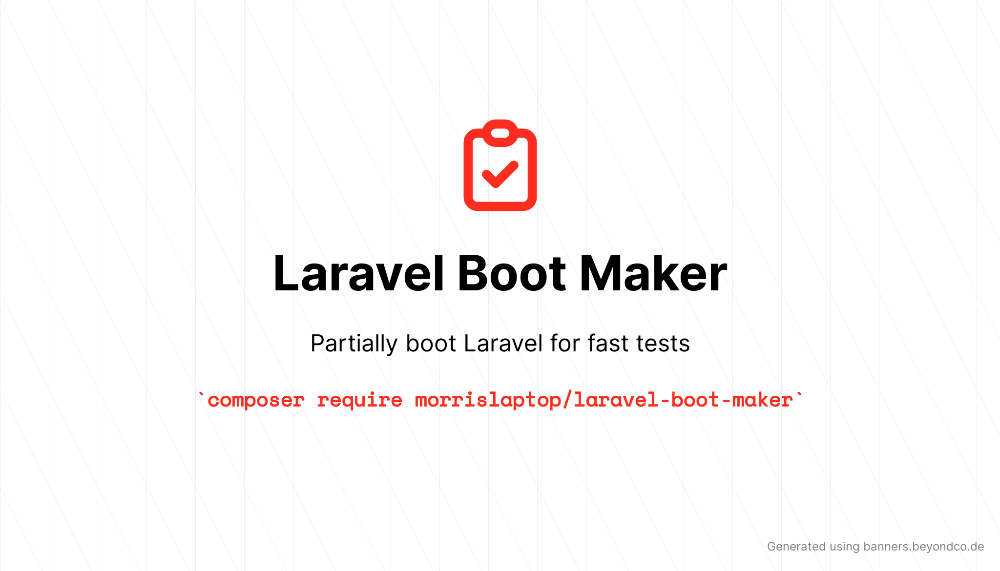

# Laravel Boot Maker

[](https://packagist.org/packages/morrislaptop/laravel-boot-maker)
[](https://github.com/morrislaptop/laravel-boot-maker/actions?query=workflow%3Arun-tests+branch%3Amain)
[](https://github.com/morrislaptop/laravel-boot-maker/actions?query=workflow%3A"Fix+PHP+code+style+issues"+branch%3Amain)
[](https://packagist.org/packages/morrislaptop/laravel-boot-maker)



When you extend `TestCase`, you're booting the whole framework for each test in your suite.
It's likely that you're not using all the features for each test, slowing down your
test suite considerably. 

This package allows you to "opt in" to boot just the Laravel features you need for 
your test to pass. Your test will run much quicker as a result. 

## Installation

You can install the package via composer:

```bash
composer require morrislaptop/laravel-boot-maker --dev
```

Create the following trait in `tests/CreatesPartialApplication.php`

```php
<?php

namespace Tests;

trait CreatesPartialApplication
{
    /**
     * Creates the application.
     *
     * @return \Illuminate\Foundation\Application
     */
    public function createPartialApplication()
    {
        $app = require __DIR__.'/../bootstrap/app.php';

        return $app;
    }
}
```

Create a base partial test class which uses this trait at `tests/PartialTestCase.php`

```php
<?php

namespace Tests;

use Morrislaptop\LaravelBootMaker\PartialTestCase as BasePartialTestCase;

abstract class PartialTestCase extends BasePartialTestCase
{
    use CreatesPartialApplication;
}
```

## Usage

It's recommended to get the tests passing using the full `TestCase` first, and then 
drop down to `PartialTestCase` and select only the Laravel features you need.

```php
<?php

namespace Tests\Feature;

use App\Events\QuestionCreated;
use App\Listeners\AskQuestion;
use Illuminate\Support\Facades\Event;
use Morrislaptop\LaravelBootMaker\Concerns\Events;
use Tests\PartialTestCase;

class QuestionCreatedTest extends PartialTestCase
{
    use Events;

    /**
     * A basic feature test example.
     *
     * @return void
     */
    public function test_example()
    {
        Event::fake();
        Event::assertListening(QuestionCreated::class, AskQuestion::class);
    }
}
```

> This approach ensures you're only using the Laravel features 
> you think are using, which might be useful if trying to 
> decouple from the framework bit. 

## Testing

```bash
composer test
```

## Changelog

Please see [CHANGELOG](CHANGELOG.md) for more information on what has changed recently.

## Contributing

Please see [CONTRIBUTING](https://github.com/morrislaptop/.github/blob/main/CONTRIBUTING.md) for details.

## Security Vulnerabilities

Please review [our security policy](../../security/policy) on how to report security vulnerabilities.

## Credits

- [Craig Morris](https://github.com/morrislaptop)
- [All Contributors](../../contributors)

## License

The MIT License (MIT). Please see [License File](LICENSE.md) for more information.

## Todo

- [ ] Installer to create `CreatesPartialApplication` and `PartialTestCase`
- [ ] Listener to determine what Laravel features are used
