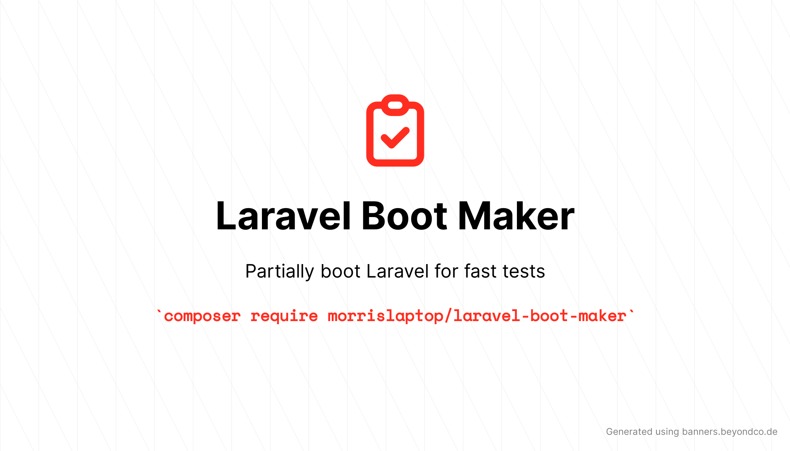

# Laravel Boot Maker

[](https://packagist.org/packages/morrislaptop/laravel-boot-maker)
[](https://github.com/morrislaptop/laravel-boot-maker/actions?query=workflow%3Arun-tests+branch%3Amain)
[](https://github.com/morrislaptop/laravel-boot-maker/actions?query=workflow%3A"Fix+PHP+code+style+issues"+branch%3Amain)
[](https://packagist.org/packages/morrislaptop/laravel-boot-maker)



When you extend `TestCase`, you're booting the whole framework for each test in your suite.
It's likely that you're not using all the features for each test, slowing down your
test suite considerably. 

This package allows you to "opt in" to boot just the Laravel features you need for 
your test to pass. Your test will run much quicker as a result. 

## Installation

You can install the package via composer:

```bash
composer require morrislaptop/laravel-boot-maker --dev
```

Create the following trait in `tests/CreatesPartialApplication.php`

```php
<?php

namespace Tests;

trait CreatesPartialApplication
{
    /**
     * Creates the application.
     *
     * @return \Illuminate\Foundation\Application
     */
    public function createApplication()
    {
        $app = require __DIR__.'/../bootstrap/app.php';

        return $app;
    }
}
```

Create a base partial test class which uses this trait at `tests/PartialTestCase.php`

```php
<?php

namespace Tests;

use Morrislaptop\LaravelBootMaker\PartialTestCase as BasePartialTestCase;

abstract class PartialTestCase extends BasePartialTestCase
{
    use CreatesPartialApplication;
}
```

## Usage

It's recommended to get the tests passing using the full `TestCase` first, and then 
drop down to `PartialTestCase` and select only the Laravel features you need.

> This approach ensures you're only using the Laravel features 
> you think are using, which might be useful if trying to 
> decouple from the framework bit.

```php
<?php

namespace Tests\Feature;

use App\Events\QuestionCreated;
use App\Listeners\AskQuestion;
use Illuminate\Support\Facades\Event;
use Morrislaptop\LaravelBootMaker\Concerns\Events;
use Tests\PartialTestCase;

class QuestionCreatedTest extends PartialTestCase
{
    use Events;

    /**
     * A basic feature test example.
     *
     * @return void
     */
    public function test_example()
    {
        Event::fake();
        Event::assertListening(QuestionCreated::class, AskQuestion::class);
    }
}
```

### HTTP requests and authentication

`Routes` lets `$this->get()` and friends run without a full boot:

```php
use Morrislaptop\LaravelBootMaker\Concerns\Auth;
use Morrislaptop\LaravelBootMaker\Concerns\Routes;
use Tests\PartialTestCase;

class ProfileTest extends PartialTestCase
{
    use Auth, Routes;

    public function test_it_shows_the_current_user()
    {
        $this->actingAs(new User(['name' => 'Bob']));

        $this->get('/me')->assertOk()->assertSee('Bob');
    }
}
```

- Errors still render: a missing route is a 404, a failed validation is a 422.
- Route model binding works. A missing model is a 404. Add `Database` for it.
- **Middleware does not run.** Test middleware on the full `TestCase`.
- Route files run your code, so a route test can need concerns it does not seem to use.
  Add what the error names.
- `Auth` is enough for `actingAs()`, `$request->user()` and `$request->session()`. To
  find a user by id, add `Database` too.

### Extra service providers

Put providers that no concern covers on your base test case:

```php
abstract class PartialTestCase extends BasePartialTestCase
{
    use CreatesPartialApplication;

    protected function additionalProviders(): array
    {
        return [\Inertia\ServiceProvider::class];
    }
}
```

Only `Routes`, `Console` and `AdditionalProviders` register them. Use `AdditionalProviders`
when a test needs a provider but makes no request and runs no command.

- One test can add a provider on top of the base list:

  ```php
  protected function additionalProviders(): array
  {
      return [...parent::additionalProviders(), X::class];
  }
  ```

- Providers that change the database layer, for example by rebinding `db.factory`, go in
  `databaseProviders()`. `Database` registers them before the database manager is built.

### Commands and migrations

`Console` lets `$this->artisan()` run without a full boot. `RefreshDatabase` and
`DatabaseMigrations` use it.

On Laravel 11 and later, list the commands the test runs:

```php
protected function consoleCommands(): array
{
    return [\App\Console\Commands\PruneProductTags::class];
}
```

- The schedule is not available. Resolving it throws `FullBootRequired`.
- Both run `migrate:fresh`. They ignore an override of `refreshTestDatabase()`.

### Two traps

- `Database` alone does not roll back. A test that writes keeps its rows. Use
  `DatabaseTransactions` or `RefreshDatabase` for those. Both include `Database`.
- A file can pass alone and fail in the full suite, because an earlier full boot leaves
  global state behind. Run the whole suite before you keep a conversion.

For a full list of features to enable, see [src/Concerns](src/Concerns/);

You can easily create your own Concerns by including it in a TestCase and ensuring
it has the `setUpXXXX` and `tearDownXXXX` methods.  

## AI agents

This package ships [Laravel Boost](https://laravel.com/framework/docs/boost) resources, so
agents working in an app that installs it know how to use it without being told:

- `resources/boost/guidelines/core.blade.php` — a short always-loaded note on the base class
  and the concern convention.
- `resources/boost/skills/partial-boot-testing/` — an on-demand skill with the conversion
  workflow, an error-to-concern table, and what each concern registers.

Users pick these up with `php artisan boost:install`, or `php artisan boost:update --discover`
in an app that already has Boost.

## Testing

```bash
composer test
```

## Changelog

Please see [CHANGELOG](CHANGELOG.md) for more information on what has changed recently.

## Contributing

Please see [CONTRIBUTING](https://github.com/morrislaptop/.github/blob/main/CONTRIBUTING.md) for details.

## Security Vulnerabilities

Please review [our security policy](../../security/policy) on how to report security vulnerabilities.

## Credits

Inspired by @ekvedaras at @gosuperscript

- [Craig Morris](https://github.com/morrislaptop)
- [All Contributors](../../contributors)

## License

The MIT License (MIT). Please see [License File](LICENSE.md) for more information.

## Todo

- [ ] Installer to create `CreatesPartialApplication` and `PartialTestCase`
- [ ] Listener to determine what Laravel features are used
